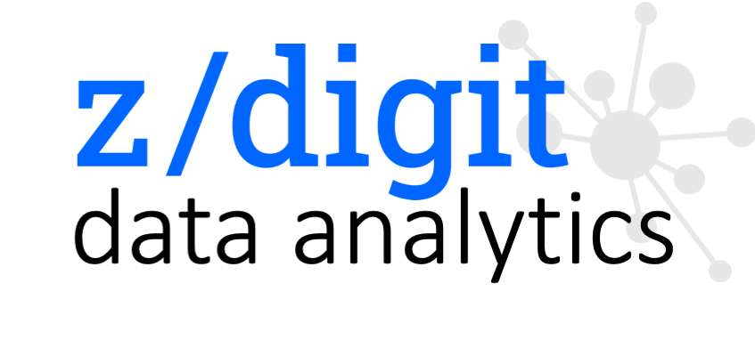

<!-- AUTO-GENERATED-CONTENT:START (STARTER) -->
<p align="center">
  <a href="https://www.zdigit.com">
    
  </a>
</p>
<h1 align="center">
  Team Data Analytics
</h1>
<p align="center">
  Zeppelin Digit for IT, Digitalization & Innovation
</p>

Kick off your project with this blog boilerplate. This starter ships with the main Gatsby configuration files you might need to get up and running blazing fast with the blazing fast app generator for React.

## 🚀 Quick start

1.  **Running a Gatsby site.**

    Use the Gatsby CLI to create a new site, specifying the blog starter.

    ```shell
    gatsby develop
    ```
